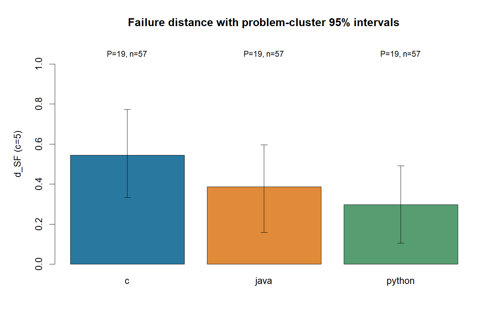
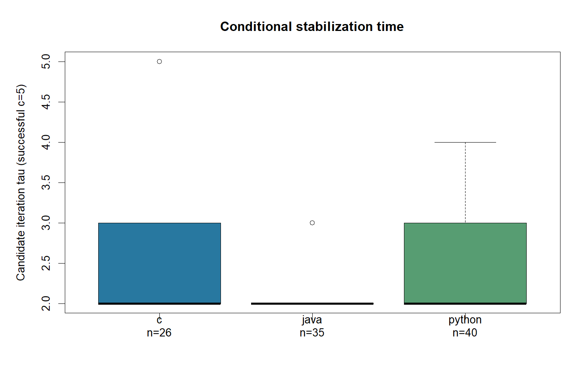
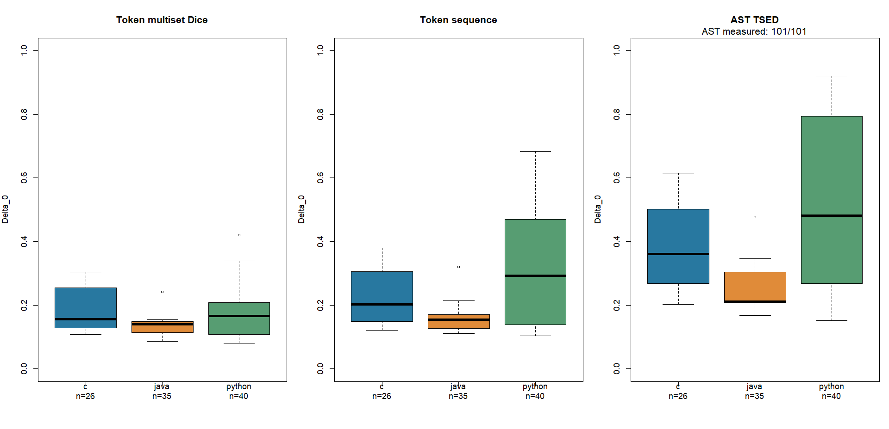
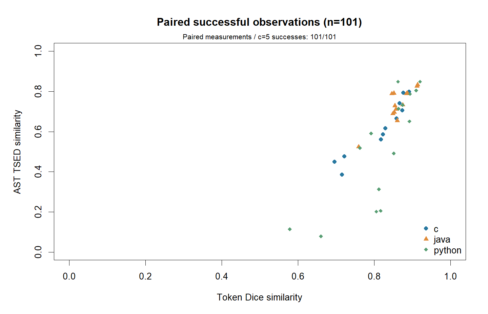

# 1차 실험 결과 v1.1

확인 왕복 5회 기준 통합 SF 성공률은 C 45.6% (26/57), Java 61.4% (35/57), Python 70.2% (40/57)였다. 이 비율과 실패 거리 d_SF를 주 결과로 사용하며, 짧은 실패 종료를 가까운 거리로 해석하지 않는다.

## 실험 범위와 방법

실험 단위는 (문제, 경로, run-id)이다. 원본 검증을 통과한 19문제, C/Java/Python 3경로, 3회 반복으로 총 171개 관측을 수집했다. 예비 실행은 본 실험에 합산하지 않았다.

SF(Stabilized and Functional)는 후보 안정화가 존재하고, 후보까지 모든 중간/복원 단계가 fixture를 통과하며, 추가 확인 왕복에서도 동일한 정규화 토큰 해시와 기능 통과가 유지된 경우다. 후보 탐색 상한 K=10, 확인 왕복 상한 c_max=5이다. 첫 왕복은 t=1이고 tau는 확인 왕복을 제외한 후보 시점이다. parse_error는 분모에 포함한다.

모델: qwen2.5-coder-7b-instruct, 양자화 Q4_K_M, 로드 컨텍스트 8192, LM Studio 0.4.24.0. temperature=0, max_tokens=4096. 컴파일/fixture당 시간 제한 30초. 요청의 나머지 디코딩 설정은 `{'top_p': 1, 'top_k': 0, 'repeat_penalty': 1, 'seed': 20260911}`이다.

실행 스케줄은 `{'parallel_runs': 3, 'parallel_routes_per_run': 1}`이다. 본 실험의 3개 run은 동시에 실행하며 각 run 내부의 문제·경로·번역 단계는 순차 실행한다. 병렬 부하도 실험 조건의 일부다.

실험 버전 `v1.1-main-a`, 조건 해시 `29e16350e2c777776f7ff61f106ded25f3d8d66401edf169916f885f1cc82349`, 검증 해시 `d6a73caf81a3c409125b2705e5654814dddc6f8ec3d3c38fb10e307634d78da2`. 실행 코드 커밋 `cca87d17112eac0addea78170cfcfc0aff602dc2`, lock SHA256 `93e4829bd7202cb2812d9eab1dd8c0b796824d984df682627380465ab85939c9`. Python과 도구 버전, 파일별 해시 및 실제 소스 스냅샷은 각 run의 run_metadata.json과 code_snapshot에 보존한다.

문제 집합: IPOP_10988, IPOP_1158, IPOP_11729, IPOP_1436, IPOP_14719, IPOP_1620, IPOP_18870, IPOP_1929, IPOP_1992, IPOP_2003, IPOP_2110, IPOP_2217, IPOP_2579, IPOP_2609, IPOP_5567, IPOP_9012, IPOP_9251, IPOP_9663, IPOP_9935.

실행 환경은 Windows-11-10.0.26200-SP0, Python 3.14.7 (main, Sep  1 2026, 14:17:30) [MSC v.1944 64 bit (AMD64)]이다. 생성 Python 코드도 `D:\works\paper-lang-dist\.venv\Scripts\python.exe`로 실행했다.

| 도구 | 기록된 버전 | 실행 경로 |
|---|---|---|
| g++ | g++.EXE (GCC) 15.2.0 | `D:/works/paper-lang-dist/.tools/gcc/bin\g++.EXE` |
| gcc | gcc.EXE (GCC) 15.2.0 | `D:/works/paper-lang-dist/.tools/gcc/bin\gcc.EXE` |
| javac | javac 21.0.12.1 | `C:\Users\sigma\scoop\apps\temurin21-jdk\current\bin\javac.EXE` |
| java | openjdk version "21.0.12.1" 2026-08-18 LTS | `C:\Users\sigma\scoop\apps\temurin21-jdk\current\bin\java.EXE` |
| uv | uv 0.12.13 (0ebbd9274 2026-09-10 x86_64-pc-windows-msvc) | `C:\Users\sigma\scoop\shims\uv.EXE` |
| Rscript | Rscript (R) version 4.6.1 (2026-06-24) | `D:/works/paper-lang-dist/.tools/R/bin/x64\Rscript.EXE` |

컴파일 옵션: `{'cpp': ['-O2', '-std=c++17'], 'c': ['-O2', '-std=c11'], 'java': ['-encoding', 'UTF-8']}`. AST 패키지: `{'tree-sitter': '0.26.0', 'tree-sitter-cpp': '0.23.4', 'apted': '1.0.3'}`. AST 제한: `{'node_limit': 5000, 'timeout': 30, 'memory_mb': 512}`(노드 수, 초, MiB). 표와 상자그림의 사분위수는 선형 보간(R type=7)을 사용한다.

프롬프트 버전 `rtt.prompts.v1`, 실제 템플릿 SHA256 `fb1d7ea2a05d7cf5000ee503b847837b2fc6aa1fe25e7a08261fa022787fb93c`, 추출기 SHA256 `1754e856905aef7e61825345cdcd4b71860f6e6232b3586c2ff08c22c3cdd687`. 실행 당시 코드와 보고서 출력 보완 이력은 `docs/EXPERIMENT_v1_log.md`에서 구분한다.

## 표 1. 안정화와 기능 보존의 성공률 및 실패 거리

통합 비율의 95% 구간은 문제 단위 percentile bootstrap 2,000회(seed=20260911)로 계산했다. 같은 문제의 모든 경로와 반복을 함께 재표집한다. 세 반복은 독립 문제 수를 늘리지 않는다.

| 경로 | c | 성공/평가 | p_SF (95% CI) | d_SF (95% CI) | CI 상태 |
|---|---:|---:|---|---|---|
| cpp-to-c | 1 | 26/57 | 45.6% [22.8%, 66.7%] | 54.4% [33.3%, 77.2%] | measured |
| cpp-to-c | 5 | 26/57 | 45.6% [22.8%, 66.7%] | 54.4% [33.3%, 77.2%] | measured |
| cpp-to-java | 1 | 35/57 | 61.4% [40.4%, 84.2%] | 38.6% [15.8%, 59.6%] | measured |
| cpp-to-java | 5 | 35/57 | 61.4% [40.4%, 84.2%] | 38.6% [15.8%, 59.6%] | measured |
| cpp-to-python | 1 | 40/57 | 70.2% [50.9%, 89.5%] | 29.8% [10.5%, 49.1%] | measured |
| cpp-to-python | 5 | 40/57 | 70.2% [50.9%, 89.5%] | 29.8% [10.5%, 49.1%] | measured |

경로 차이 역시 같은 문제를 함께 재표집해 계산했다. 아래 구간이 0을 포함하면 이번 표본에서 차이의 방향이 명확하다고 판단하지 않는다.

| 경로 차이 (앞-뒤) | c | p_SF 차이 | 대응 bootstrap 95% CI |
|---|---:|---:|---|
| cpp-to-c minus cpp-to-java | 1 | -15.8%p | [-43.9, 12.3]%p |
| cpp-to-c minus cpp-to-java | 5 | -15.8%p | [-43.9, 12.3]%p |
| cpp-to-c minus cpp-to-python | 1 | -24.6%p | [-50.9, 0.0]%p |
| cpp-to-c minus cpp-to-python | 5 | -24.6%p | [-50.9, 0.0]%p |
| cpp-to-java minus cpp-to-python | 1 | -8.8%p | [-31.6, 15.8]%p |
| cpp-to-java minus cpp-to-python | 5 | -8.8%p | [-31.6, 15.8]%p |

## 표 2. 성공 조건부 후보 시점과 코드 변화

c=5 성공 집합만 사용한다. 값은 중앙값 [Q1, Q3], 유효 n이다. Delta_0는 원본 C++와 후보 C++ 사이의 1-유사도이다.

| 경로 | tau | Delta_0 Dice | Delta_0 sequence | Delta_0 AST | AST 측정률 |
|---|---|---|---|---|---|
| cpp-to-c | 2.000 [2.000, 3.000], n=26 | 0.156 [0.128, 0.254], n=26 | 0.202 [0.148, 0.305], n=26 | 0.360 [0.268, 0.502], n=26 | 100.0% |
| cpp-to-java | 2.000 [2.000, 2.000], n=35 | 0.140 [0.113, 0.148], n=35 | 0.155 [0.127, 0.170], n=35 | 0.212 [0.209, 0.303], n=35 | 100.0% |
| cpp-to-python | 2.000 [2.000, 3.000], n=40 | 0.166 [0.108, 0.208], n=40 | 0.292 [0.139, 0.469], n=40 | 0.482 [0.267, 0.794], n=40 | 100.0% |

AST는 tree-sitter의 named 노드를 순서대로 사용하며 식별자는 추상화하고 연산자·리터럴 값은 보존한다. 삽입/삭제/변경 비용은 1/1/1이다. 이는 이번 실험의 TSED 정의이며 구문 구조 비교에 해당한다. AST 결측은 SF 결과를 바꾸지 않는다.

## 표 3. 실패 이유

c=5 기준이며 비율의 분모는 각 경로의 전체 평가 가능 관측 수다. 범주 비율의 합은 d_SF이다.

| 경로 | 기능 오류 | 순환 | K 도달 | 확인 해시 변경 | 출력 형식 오류 |
|---|---|---|---|---|---|
| cpp-to-c | 31 (54.4%) | 0 (0.0%) | 0 (0.0%) | 0 (0.0%) | 0 (0.0%) |
| cpp-to-java | 21 (36.8%) | 0 (0.0%) | 0 (0.0%) | 1 (1.8%) | 0 (0.0%) |
| cpp-to-python | 16 (28.1%) | 0 (0.0%) | 0 (0.0%) | 1 (1.8%) | 0 (0.0%) |

기능 오류의 세부 상태는 다음과 같다. 각 셀은 건수이며 시간 초과는 실행 제한에 따른 결과다.

| 경로 | 컴파일 오류 | 오답 | 실행 오류 | 실행 시간 초과 |
|---|---:|---:|---:|---:|
| cpp-to-c | 7 | 15 | 6 | 3 |
| cpp-to-java | 9 | 12 | 0 | 0 |
| cpp-to-python | 3 | 6 | 7 | 0 |

## 확인 횟수에 따른 변화

| 경로 | c=0 | c=1 | c=2 | c=3 | c=4 | c=5 |
|---|---|---|---|---|---|---|
| cpp-to-c | 47.4% | 45.6% | 45.6% | 45.6% | 45.6% | 45.6% |
| cpp-to-java | 63.2% | 61.4% | 61.4% | 61.4% | 61.4% | 61.4% |
| cpp-to-python | 71.9% | 70.2% | 70.2% | 70.2% | 70.2% | 70.2% |

c=0 후보·기능 조건을 만족한 뒤 c=5까지 유지하지 못한 관측은 3건이다. 확인 횟수를 늘릴 때 p_SF가 낮아지는 정도는 후보 안정화와 관찰 기간 동안의 유지가 얼마나 다른지를 보여준다. 평탄한 구간이 나타나더라도 이 결과만으로 이후 모든 왕복의 영구 안정화를 보장하지 않는다.


## 그림










## 실행 비용과 응답 감사

API 시간은 호출별 경과 시간의 합이며, 병렬 실행의 실제 경과 시간과 다르다. 재시도는 실제 API 시도 수에서 논리 요청 수를 뺀 값이다.

| run | 논리 요청 | API 시도 | API 시간 합(초) | 평균/최대(초) | 입력/출력 토큰 | API 오류 | 절단 | 형식 오류 |
|---|---:|---:|---:|---|---|---:|---:|---:|
| v1-qwen25-7b-p1-r1 | 529 | 529 | 4097.6 | 7.746/15.568 | 392504/97356 | 0 | 0 | 0 |
| v1-qwen25-7b-p1-r2 | 546 | 546 | 4326.4 | 7.924/15.908 | 404183/100283 | 0 | 0 | 0 |
| v1-qwen25-7b-p1-r3 | 527 | 527 | 4199.5 | 7.969/15.617 | 392720/96718 | 0 | 0 | 0 |

실험 시작부터 마지막 관측 종료까지 83.09분이 걸렸다(UTC 2026-09-11T08:39:28.688815+00:00 ~ 2026-09-11T10:02:34.027274+00:00). 이 경과 시간은 최종 AST 집계·그림·보고서 작성 시간을 포함하지 않는다.


## 부록: c=1 조건부 결과

| 경로 | tau | Delta_0 Dice | Delta_0 sequence | Delta_0 AST |
|---|---|---|---|---|
| cpp-to-c | 2.000 [2.000, 3.000], n=26 | 0.156 [0.128, 0.254], n=26 | 0.202 [0.148, 0.305], n=26 | 0.360 [0.268, 0.502], n=26 |
| cpp-to-java | 2.000 [2.000, 2.000], n=35 | 0.140 [0.113, 0.148], n=35 | 0.155 [0.127, 0.170], n=35 | 0.212 [0.209, 0.303], n=35 |
| cpp-to-python | 2.000 [2.000, 3.000], n=40 | 0.166 [0.108, 0.208], n=40 | 0.292 [0.139, 0.469], n=40 | 0.482 [0.267, 0.794], n=40 |

## 부록: 반복별 성공률

| 경로 | run | c=1 | c=5 | c=5 Wilson 95% CI |
|---|---|---|---|---|
| cpp-to-c | v1-qwen25-7b-p1-r1 | 42.1% | 42.1% | [23.1%, 63.7%] |
| cpp-to-c | v1-qwen25-7b-p1-r2 | 47.4% | 47.4% | [27.3%, 68.3%] |
| cpp-to-c | v1-qwen25-7b-p1-r3 | 47.4% | 47.4% | [27.3%, 68.3%] |
| cpp-to-java | v1-qwen25-7b-p1-r1 | 57.9% | 57.9% | [36.3%, 76.9%] |
| cpp-to-java | v1-qwen25-7b-p1-r2 | 63.2% | 63.2% | [41.0%, 80.9%] |
| cpp-to-java | v1-qwen25-7b-p1-r3 | 63.2% | 63.2% | [41.0%, 80.9%] |
| cpp-to-python | v1-qwen25-7b-p1-r1 | 73.7% | 73.7% | [51.2%, 88.2%] |
| cpp-to-python | v1-qwen25-7b-p1-r2 | 73.7% | 73.7% | [51.2%, 88.2%] |
| cpp-to-python | v1-qwen25-7b-p1-r3 | 63.2% | 63.2% | [41.0%, 80.9%] |

| 경로 | c | run별 p_SF 평균 | 최소 | 최대 |
|---|---:|---:|---:|---:|
| cpp-to-c | 1 | 45.6% | 42.1% | 47.4% |
| cpp-to-c | 5 | 45.6% | 42.1% | 47.4% |
| cpp-to-java | 1 | 61.4% | 57.9% | 63.2% |
| cpp-to-java | 5 | 61.4% | 57.9% | 63.2% |
| cpp-to-python | 1 | 70.2% | 63.2% | 73.7% |
| cpp-to-python | 5 | 70.2% | 63.2% | 73.7% |

같은 문제·경로·왕복 번호에서 세 run의 복원 C++ 해시를 비교했다. 비교 가능한 240개 위치 중 205개에서 모두 일치했다(일치율 85.4%). 미도달 또는 실패로 비교할 수 없는 위치는 46개이며, 후보/확인 단계가 서로 다른 위치는 11개다. 이 일치율은 관측 위치에 대한 기술 통계이며 독립 표본의 성공률로 해석하지 않는다.

## 부록: 출력 형식 오류 제외 민감도

| 경로 | c | 기본 p_SF | 형식 오류 제외 p_SF | 제외 후 분모 | 제외된 성공 수 |
|---|---:|---|---|---:|---:|
| cpp-to-c | 0 | 47.4% | 47.4% | 57 | 0 |
| cpp-to-c | 1 | 45.6% | 45.6% | 57 | 0 |
| cpp-to-c | 2 | 45.6% | 45.6% | 57 | 0 |
| cpp-to-c | 3 | 45.6% | 45.6% | 57 | 0 |
| cpp-to-c | 4 | 45.6% | 45.6% | 57 | 0 |
| cpp-to-c | 5 | 45.6% | 45.6% | 57 | 0 |
| cpp-to-java | 0 | 63.2% | 63.2% | 57 | 0 |
| cpp-to-java | 1 | 61.4% | 61.4% | 57 | 0 |
| cpp-to-java | 2 | 61.4% | 61.4% | 57 | 0 |
| cpp-to-java | 3 | 61.4% | 61.4% | 57 | 0 |
| cpp-to-java | 4 | 61.4% | 61.4% | 57 | 0 |
| cpp-to-java | 5 | 61.4% | 61.4% | 57 | 0 |
| cpp-to-python | 0 | 71.9% | 71.9% | 57 | 0 |
| cpp-to-python | 1 | 70.2% | 70.2% | 57 | 0 |
| cpp-to-python | 2 | 70.2% | 70.2% | 57 | 0 |
| cpp-to-python | 3 | 70.2% | 70.2% | 57 | 0 |
| cpp-to-python | 4 | 70.2% | 70.2% | 57 | 0 |
| cpp-to-python | 5 | 70.2% | 70.2% | 57 | 0 |

## 불확실성과 해석 한계

단일 모델·단일 프롬프트와 선정 문제 집합의 탐색적 결과다. 언어 자체의 고유 거리로 일반화할 수 없다. SF는 관찰한 확인 횟수와 fixture에 대한 결과이며 영구 고정점이나 모든 입력의 실행 동치를 증명하지 않는다. 성공 조건부 tau와 Delta_0에는 선택 효과가 있으므로 실패 관측을 0이나 K로 대체하지 않는다.

부트스트랩 CI가 degenerate이면 구간이 퇴화한 것이며 불확실성이 없다는 뜻이 아니다. 중앙값 CI는 유효 재표집이 95% 미만이면 unavailable로 기록한다. 상세 구간과 AST 결측 사유는 summary.json에 보존한다.

## 재생성

```powershell
$env:UV_CACHE_DIR = 'D:/works/paper-lang-dist/.uv-cache'
uv run rttdist report --config lmstudio_v1.yaml --runs v1-qwen25-7b-p1-r1,v1-qwen25-7b-p1-r2,v1-qwen25-7b-p1-r3
uv run python scripts/v1_checks.py artifacts-lmstudio/v1-combined/summary.json
.tools/R/bin/x64/Rscript.exe --vanilla graph/v1/drawFigures.r artifacts-lmstudio/v1-combined/summary.json presentation/v1/results-v1.1
uv run python scripts/write_result_v1.py artifacts-lmstudio/v1-combined/summary.json RESULT_v1.1.md
```

## 부록: 조건부 중앙값 신뢰구간과 AST 결측

| 경로 | c | 지표 | 중앙값 95% CI | 유효 재표집 | CI 상태 | 결측 사유별 수 |
|---|---:|---|---|---:|---|---|
| cpp-to-c | 1 | tau | [2.000, 3.000] | 2000/2000 | measured | {} |
| cpp-to-c | 1 | token_multiset_dice | [0.126, 0.278] | 2000/2000 | measured | {} |
| cpp-to-c | 1 | token_sequence_ratio | [0.138, 0.318] | 2000/2000 | measured | {} |
| cpp-to-c | 1 | ast_tsed | [0.260, 0.523] | 2000/2000 | measured | {} |
| cpp-to-c | 5 | tau | [2.000, 3.000] | 2000/2000 | measured | {} |
| cpp-to-c | 5 | token_multiset_dice | [0.126, 0.278] | 2000/2000 | measured | {} |
| cpp-to-c | 5 | token_sequence_ratio | [0.138, 0.318] | 2000/2000 | measured | {} |
| cpp-to-c | 5 | ast_tsed | [0.260, 0.523] | 2000/2000 | measured | {} |
| cpp-to-java | 1 | tau | [2.000, 2.000] | 2000/2000 | degenerate | {} |
| cpp-to-java | 1 | token_multiset_dice | [0.113, 0.148] | 2000/2000 | measured | {} |
| cpp-to-java | 1 | token_sequence_ratio | [0.127, 0.176] | 2000/2000 | measured | {} |
| cpp-to-java | 1 | ast_tsed | [0.208, 0.303] | 2000/2000 | measured | {} |
| cpp-to-java | 5 | tau | [2.000, 2.000] | 2000/2000 | degenerate | {} |
| cpp-to-java | 5 | token_multiset_dice | [0.113, 0.148] | 2000/2000 | measured | {} |
| cpp-to-java | 5 | token_sequence_ratio | [0.127, 0.176] | 2000/2000 | measured | {} |
| cpp-to-java | 5 | ast_tsed | [0.208, 0.303] | 2000/2000 | measured | {} |
| cpp-to-python | 1 | tau | [2.000, 3.000] | 2000/2000 | measured | {} |
| cpp-to-python | 1 | token_multiset_dice | [0.108, 0.208] | 2000/2000 | measured | {} |
| cpp-to-python | 1 | token_sequence_ratio | [0.139, 0.469] | 2000/2000 | measured | {} |
| cpp-to-python | 1 | ast_tsed | [0.267, 0.794] | 2000/2000 | measured | {} |
| cpp-to-python | 5 | tau | [2.000, 3.000] | 2000/2000 | measured | {} |
| cpp-to-python | 5 | token_multiset_dice | [0.108, 0.208] | 2000/2000 | measured | {} |
| cpp-to-python | 5 | token_sequence_ratio | [0.139, 0.469] | 2000/2000 | measured | {} |
| cpp-to-python | 5 | ast_tsed | [0.267, 0.794] | 2000/2000 | measured | {} |

## 본 실험의 핵심 해석

확인 5회 기준 성공은 C 26/57(45.6%), Java 35/57(61.4%), Python 40/57(70.2%)였다. Python의 관측 성공률이 가장 높지만, 문제 단위 대응 부트스트랩에서 C-Java 차이의 95% 구간은 [-43.9, 12.3]%p, C-Python은 [-50.9, 0.0]%p, Java-Python은 [-31.6, 15.8]%p였다. 모든 구간이 0을 포함하므로 이번 19문제로 경로 순위를 확정하지 않는다. 특히 C-Python 구간의 상한은 정확히 0이며, 반올림으로 양의 차이가 숨겨진 경우가 아니다.

전체 171건 중 c=5 성공은 101건, 실패는 70건이었다. 실패 중 68건은 기능 오류(컴파일 19, 오답 33, 실행 오류 13, 실행 시간 초과 3), 나머지 2건은 확인 해시 변경이었다. 순환·K 도달·출력 형식 오류는 관측되지 않았다. 짧은 종료 횟수만으로 경로를 평가하면 이러한 기능 실패를 안정화와 혼동할 수 있지만, 이번 주 지표는 실패를 분모에 남기고 성공 조건부 tau에서 제외한다.

성공 관측의 tau 중앙값은 세 경로 모두 2였지만 IQR은 C와 Python [2, 3], Java [2, 2]였다. 후보 탐색이 빠른 성공들 사이에서도 전체 성공률은 달랐으므로 tau만으로 경로 성능을 요약하기 어렵다. Java의 tau 중앙값 부트스트랩 구간 [2, 2]는 퇴화 구간이며, 모든 관측이 tau=2이거나 불확실성이 없다는 뜻은 아니다.

c=0의 성공 104건 중 3건이 첫 확인에서 탈락했다. 모두 IPOP_9935이며, 세 번째 반복의 C는 확인 단계 오답, 첫 번째 반복의 Java와 세 번째 반복의 Python은 해시 변경이었다. 따라서 각 경로의 p_SF가 c=0에서 c=1로 1/57(1.75%p) 감소했고 c=1..5에서는 추가 감소가 없었다. 첫 확인은 후보 도달만으로 발견할 수 없는 실패를 검출했다. 다만 관측된 평탄함만으로 확인 2~5회가 일반적으로 불필요하다고 결론 내리지 않으며, 확인 횟수 축소는 후속 실험에서 검증할 가설로 남긴다.

c=5 성공의 AST는 101/101건 모두 측정됐다. Delta_0 AST 중앙값은 C 0.360, Java 0.212, Python 0.482였고 Python의 sequence 변화량도 0.292로 가장 컸다. 이는 성공한 복원 코드에서 구조 변화가 남을 수 있음을 보여준다. 경로마다 성공한 문제 집합이 다르므로 이 조건부 중앙값의 차이를 동일 문제에 대한 순수한 언어 효과로 해석하지 않는다.

반복 간 비교 가능한 240개 위치 중 205개(85.4%)에서 세 run의 해시가 모두 일치했다. 미도달/실패 위치 46개와 단계 불일치 위치 11개도 별도로 기록했다. 고정 seed와 temperature=0에서도 결과가 완전히 같지는 않았으며, 모델 응답의 변동과 병렬 실행 환경을 언어 효과에서 분리할 자료는 이번 실험에 없다.

본 실험의 논리 요청과 실제 API 시도는 각각 1,602회였고 입력 토큰 1,189,407개, 출력 토큰 294,357개를 사용했다. API 오류·재시도·응답 절단·출력 형식 오류와 미해결 인프라·미완료 관측은 모두 0건이었다. 따라서 출력 형식 오류 제외 민감도 결과는 기본 성공률과 같다. 원본 응답, 실제 실행 소스, fixture 결과, 해시 이력, 후보·확인 성공 prefix를 전수 대조한 완료 감사가 171건 모두 통과했다.

## 코퍼스 감사와 해석 범위

원본 20문제 중 IPOP_1260은 10개 fixture 모두에서 출력이 비어 검증을 통과하지 못했다. 해당 입력 파일 첫 줄의 `:` 때문에 reference.cpp의 정수 입력이 실패하고 조기 종료한다. 따라서 세 경로 모두에서 제외하며 모델의 기능 오류로 세지 않는다. 원본과 fixture를 수정하지 않았고, 나머지 19문제가 사전 검증을 통과했다.

검증을 통과한 19문제에는 fixture 입력 파일 190개가 있지만, 문제별로 바이트 내용 중복을 제거한 서로 다른 입력은 총 70개다. 특히 8문제(IPOP_1158, IPOP_11729, IPOP_1620, IPOP_1929, IPOP_1992, IPOP_2609, IPOP_9251, IPOP_9663)는 입력이 한 종류뿐이다. 프롬프트가 첫 fixture 입력과 정답을 제공하므로 이 8문제의 평가는 프롬프트에 제시하지 않은 입력에 대한 검증을 포함하지 않는다. fixture 10쌍을 서로 다른 10개 테스트로 해석하면 안 된다. 상세 중복 수는 `artifacts-lmstudio/preflight-v1/fixture_diversity.json`에 저장했다.

## 예비 실행에서 확인한 빠른 실패 사례

예비 실행은 5문제 x 3경로 = 15개 관측을 완료했으며 약 18분 20.6초가 걸렸다. 논리 요청과 실제 API 시도는 각각 147회, 호출 평균 6.120초, 입력 토큰 120947, 출력 토큰 29070이다. API 오류·재시도·출력 절단·parse_error는 없었다. c=5의 성공은 C 2/5, Java 4/5, Python 4/5였으며 성공 10건의 tau는 모두 2였다. 예비 생성 C++ 71쌍은 AST 측정이 모두 가능했고, 최대 표현 노드 수 272, 최대 처리 시간 0.869초, 최대 프로세스 메모리 33.477 MiB였다. 이 근거로 max_tokens=4096, 컴파일/fixture당 30초, AST 5000노드/30초/512 MiB 설정을 유지했다.

예비 실행 IPOP_1436의 C 경로는 첫 번역 직후 기능 오류로 종료됐다. 생성 코드의 `strstr((char*)&value, "666")`는 정수를 십진 문자열로 변환하는 대신 정수의 메모리를 문자열처럼 읽는다. 첫 fixture부터 오답이 발생했고 10번 fixture는 30초 제한을 넘겼다. 이 실행은 짧은 종료 횟수로 가까운 언어 거리를 뜻하는 것이 아니다. SF 정의에서는 후보 안정화가 없으므로 c=0부터 실패이며 조건부 tau와 Delta_0 계산에서 빠진다. 이 사례는 예비 자료로만 설명하며 본 실험 분모에 합산하지 않는다.

## 본 실험의 컴파일 실패 사례

본 실험의 IPOP_10988 C 경로는 세 run 모두 `stdbool.h`를 포함하지 않은 채 `bool`, `true`, `false`를 사용해 C11 컴파일에 실패했다. 세 생성 코드의 정규화 토큰 해시는 동일했다. 이는 고정 모델·프롬프트가 대상 언어의 헤더/타입 요구를 충족하지 못한 사례이며, 순수한 언어 간 구조 차이만으로 해석할 수 없다. 컴파일러를 바꾸거나 헤더를 자동 삽입해 해당 실패만 구제하지 않았다.

## 후보 안정화 후 확인에서 달라진 사례

첫 번째 반복의 IPOP_9935 Java 경로는 tau_c=2에서 후보·기능 조건을 만족했지만 첫 확인 왕복(t=3)에서 복원 C++ 해시가 바뀌었다. `std::string res = "";`가 `std::string res;`로, `res = res.substr(0, res.length() - b_len);`가 `res.resize(res.length() - b_len);`로 변경됐다. 여섯 번역 단계 모두 fixture를 통과했으며 해당 확인 왕복의 Delta_step은 Dice와 sequence 모두 0.02424였다. [후보 코드](artifacts-lmstudio/v1-qwen25-7b-p1-r1/IPOP_9935/cpp-to-java/attempt-001/iterations/iter-002/roundtrip.cpp)와 [확인 코드](artifacts-lmstudio/v1-qwen25-7b-p1-r1/IPOP_9935/cpp-to-java/attempt-001/iterations/iter-003/roundtrip.cpp)에 차이가 보존돼 있다.

이 관측은 c=0에서 성공이고 c=1..5에서 실패다. 기능 오류와 구별되는 확인 해시 변경이며, 작은 코드 표현 변화도 엄격한 안정화 판정을 깨뜨릴 수 있음을 보여준다. 후보 도달 즉시 종료하면 이 변화는 관측하지 못한다. 반대로 해시 변경 자체를 기능 상실로 해석해서도 안 된다.

세 번째 반복의 IPOP_9935 Python 경로에서도 tau_c=2 후 첫 확인에서 입출력 동기화·스트림 연결 설정 세 줄이 제거됐다. 모든 단계의 fixture는 통과했고 Delta_step은 Dice와 sequence 모두 0.06383이었다. 이 사례의 원본 diff도 해당 run의 diagnostics.json에 보존했다. C 경로의 확인 실패는 복원 C++에 도달하기 전 기능 검사에서 종료됐으므로, 존재하지 않는 복원 코드의 Delta_step을 0으로 채우지 않는다.

## 실제 코드에서 토큰과 AST 변화가 달라지는 사례

IPOP_10988의 Python 경로는 세 반복 모두 tau=3에서 후보에 도달하고 확인 5회를 통과했다. 원본은 main 안의 for 루프에서 문자열의 대칭 위치를 비교하고 valid 플래그를 갱신한다. 복원 후보는 is_palindrome 함수를 분리하고 left/right 두 인덱스를 움직이는 while 루프와 즉시 반환으로 바뀌었다. 입출력 설정과 네임스페이스 표기도 달라졌다. [원본 코드](artifacts-lmstudio/v1-qwen25-7b-p1-r1/IPOP_10988/cpp-to-python/attempt-001/seed.cpp)와 [복원 후보](artifacts-lmstudio/v1-qwen25-7b-p1-r1/IPOP_10988/cpp-to-python/attempt-001/iterations/iter-003/roundtrip.cpp)를 대조했다.

이 사례의 Delta_0는 세 반복 모두 Dice 0.3391, sequence 0.6087, AST 0.9211이었다. 유사도로 바꾸면 각각 0.6609, 0.3913, 0.0789이다. 토큰의 상당 부분을 공유하면서도 함수 분리·제어 흐름·트리 배치가 크게 달라질 수 있음을 보여준다. AST 변화량이 크다는 사실은 기능 실패를 뜻하지 않으며, 이 관측의 SF 성공도 제공된 fixture와 확인 5회에 한정된다. 지표 간 차이를 문장 순서 변경 하나만으로 설명하지 않고 실제 코드의 여러 변화를 함께 확인해야 한다.

## 구버전 자료의 재평가

기존 `lmstudio-rtt-demo`의 3경로는 저장된 해시와 모든 단계 검사 기록에 따르면 tau_c=2에서 c=0 후보·기능 조건을 만족했다. 그러나 과거 원본 사전 실행 검증 이력과 추가 확인 왕복 기록이 없으므로 새 본 실험에 포함하지 않는다. c>=1은 `confirmed: unavailable`이며 0 또는 성공으로 대체하지 않았다. 재평가 결과는 `artifacts-lmstudio/lmstudio-rtt-demo/legacy_sf_reassessment.json`에 저장했다. 모델·프롬프트·문제 집합이 다른 과거 발표와 이번 실험의 순위를 직접 비교하지 않는다.

## 변형 집합에 대한 지표 반응

변형 집합은 지표가 의도한 정보를 보존하는지 확인하기 위한 것이며 모든 변형이 기능을 보존한다고 가정하지 않는다.

아래 값은 변화량이 아닌 유사도이며, 1이면 해당 표현에서 동일하다.

| 변형 | 토큰 Dice | 토큰 sequence | 추상화 AST TSED | 관찰 |
|---|---:|---:|---:|---|
| 동일 코드 | 1.0000 | 1.0000 | 1.0000 | 변화량 0 |
| 식별자만 일대일 변경 | 0.7037 | 0.7037 | 1.0000 | 식별자 이름 추상화 |
| 구별 가능한 문장 순서 교환 | 1.0000 | 0.7407 | 0.9394 | 순서 변화 반영, 토큰 Dice는 1 |
| 추상화 후 동일 구조인 문장 교환 | 1.0000 | 0.7143 | 1.0000 | 추상화로 구별이 사라지는 한계 |
| `+`를 `-`로 변경 | 0.9630 | 0.9630 | 0.9697 | 연산자 값 보존 |
| 리터럴 1을 3으로 변경 | 0.9630 | 0.9630 | 0.9697 | 리터럴 값 보존 |
| for를 while로 변경 | 0.9429 | 0.8286 | 0.7250 | 구조 변화 반영 |
| 원본을 다른 구현으로 대체 | 0.6190 | 0.5238 | 0.3333 | 구현 구조 변화 반영 |

전체 토큰/AST 값은 `artifacts-lmstudio/preflight-v1/similarity_variants.json`에 저장했다. 연산자나 리터럴 하나를 바꾸어 기능이 달라져도 AST 유사도는 높게 남을 수 있으므로 TSED를 기능 보존 검사 대신 사용하지 않는다.

## 방법과 도구의 근거

토큰 시퀀스 지표는 입력 방향을 원본/이전 코드에서 후보/이후 코드로 고정하고 SequenceMatcher의 autojunk를 끈다. LCS나 대칭 거리로 해석하지 않는다. [Python difflib 문서](https://docs.python.org/3.14/library/difflib.html).

모델 양자화와 컨텍스트는 파일명에서 추정하지 않고 실행 시작 시 native API의 실제 로드 설정을 저장했다. [LM Studio 모델 목록 API](https://lmstudio.ai/docs/developer/rest/list).

AST 표현과 단위 비용 TSED는 이 실험의 고정 정의이며, 원 논문의 비용 조정값을 재현한 것으로 주장하지 않는다. [Song 등의 AST 편집 유사도 연구](https://aclanthology.org/2024.acl-short.3/).

