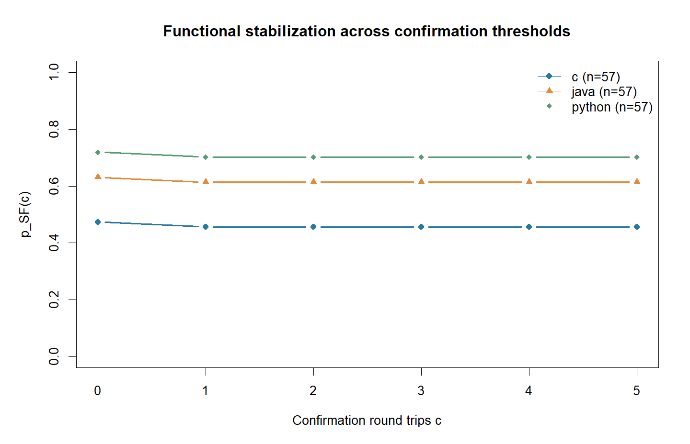

<!-- _class: lead -->

# 고정점 기반 프로그래밍 언어 거리(v0.3)

한상곤 (부산대학교 대학원 정보융합공학과)

---

<!-- _header: 1. 문제 제기: 빠른 실패가 가까운 거리로 보이는 역전 -->

"일부 모델의 Java, Python 경로가 1.0~1.2회에 종료되면서 의미 보존율은 0%" $\to$ 실패율을 별도 성분으로 남기고, 성공한 경우에만 도달 시간과 구조 변화를 비교

| 관측 상황 | 종료 횟수 | 횟수만 비교할 때의 문제 |
| :--- | :--- | :--- |
| 첫 번역에서 컴파일, 실행 실패 | 짧음 | 의미를 잃은 경로가 가깝게 보임 |
| 기능을 유지하며 여러 번 재작성 | 길어질 수 있음 | 성공 경로가 더 멀게 보임 |

---

<!-- _header: 2. 연구 질문과 이번 연구의 범위 -->

- 모델 1개, 프롬프트 1종, 19문제 × 3경로 × 3회 = 171건
- SF 성공 기준, 실패와 조건부 변화를 분리

| 질문 | 이번 연구에서 확인할 내용 |
| :--- | :--- |
| RQ1. 빠른 실패를 막을 수 있는가? | 실패를 성공 도달 시간에서 제외하는 SF 판정과 실패율 |
| RQ2. 추가 정보를 제공하는가? | 성공 조건부 시간과 토큰, 순서, AST 변화의 비교 |

---

<!-- _header: 3. 관련 연구: 실행과 구조를 함께 보아야 하는 이유 -->

- 토큰이 유사해도 오답일 수 있음
- 구조가 달라져도 주어진 테스트를 통과할 수 있음
- 실행 테스트, 토큰 Dice, 토큰 sequence, AST TSED 사용
- CodeBLEU, 의미 그래프, 임베딩은 후속 검토 대상이며 이번 실험에서 산출하지 않음

| 연구 | 주요 관점 | 본 연구와의 연결 |
| :--- | :--- | :--- |
| RTC / Allamanis 등 (2024) | 변환 후 복원을 통한 코드 모델 평가 | 반복 왕복의 모든 단계 검사와 추가 확인 |
| TSED / Song 등 (2024) | AST 편집에 기반한 코드 유사도 | 성공한 복원 코드의 구문 구조 비교 |
| CodeBLEU / Ren 등 (2020) | n-gram, 구문, 데이터 흐름의 결합 | 여러 관점의 지표 확장에 대한 참고 |

---

<!-- _header: 4. LLM 왕복을 확률적 전이로 기술 -->

$$X_{t+1}=F_\theta(X_t,\xi_t),\qquad
P_\theta(x,U)=\Pr\{F_\theta(x,\xi)\in U\}$$

- $F_\theta$: 경로 $A \to B \to A$의 한 왕복, $\theta$: 경로, 모델, 프롬프트, 디코딩, 실행 조건, 
- $U$: 복원 코드 상태의 집합, $\xi_t$: 변동 요인
- $\mathcal E_0=\{x:x\equiv_{\mathrm{sem}}x_0\}$
- $\mathcal A_\theta\subseteq\mathcal E_0$: 의미와 정규화 표현이 확률 1로 유지
- 제공된 테스트 통과와 $c$회 추가 확인으로 관찰한 안정화

<!-- 
"인공지능을 이용한 왕복 번역 과정을 수학(확률과 통계)의 언어로 정의, 이상적인 목표와 우리가 현실에서 실험한 방식을 연결한 것"

1. 마르코프 체인과 확률적 동역학계
- C++ 코드를 Python으로 번역하고, 그걸 다시 C++로 번역하는 왕복을 반복
- C++ 코드(현재 상태)를 넣으면 -> 번역기를 거쳐 -> 새로운 C++ 코드(다음 상태)
- LLM은 매번 100% 똑같이 행동하는 계산기가 아니라, 약간의 확률적 흔들림(온도, 난수, 하드웨어 연산 오차 등)이 있음

2. 확률적 상태 전이(Stochastic Transition)

"현재 코드($X_t$)에 번역기($F_\theta$)와 약간의 무작위성($\xi_t$)이 더해져 다음 코드($X_{t+1}$)가 만들어"진다.

$$X_{t+1} = F_\theta(X_t, \xi_t)$$

- $X_{t+1}$: 그 결과로 새롭게 만들어진 다음 C++ 코드
- $F_\theta$: 시스템 전체 (Qwen 모델, 프롬프트 지시문, 온도 0 등의 환경 $\theta$가 반영된 함수)
- $X_t$: $t$번째 왕복을 마친 C++ 코드
- $\xi_t$: 번역할 때마다 모델이나 서버 환경에서 생기는 미세한 무작위 변동(노이즈)

---

"현재 코드 $x$를 LLM에 넣었을 때, 그 결과가 우리가 원하는 코드 집합 $U$에 들어갈 확률"을 뜻합니다(Transition Kernel).

$$P_\theta(x, U) = \Pr\{F_\theta(x, \xi) \in U\}$$

- $U$: 우리가 원하는 어떤 코드들의 집합(정답을 맞히는 코드들의 모임)

---

"겉모습은 달라도 정답 기능은 똑같은 코드들의 집합"입니다. 예를 들어 어떤 정답 코드는 for문으로 짰고, 어떤 정답 코드는 while문으로 짰더라도 둘 다  문제를 완벽하게 맞힌다면 같은 의미 등가류에 속합니다.

$$\mathcal{E}_0$$

이론적인 고정점입니다. 한 번 이 상태에 도달하면, 앞으로 번역을 100번, 1,000번 영원히 반복해도 100% 확률로 코드가 단 한 글자도 안 바뀌고 정답 기능도 유지되는 꿈의 상태입니다.

$$\mathcal{A}_\theta$$

유한 실험의 SF(Stabilized and Functional)는 현실의 타협점입니다. 우리는 현실에서 컴퓨터를 무한히 돌릴 수도 없고, 세상의 모든 입력을 다 넣어볼 수도 없습니다. 그래서 현실적인 약속을 한 것입니다.

"주어진 10개의 테스트 케이스를 통과하고, 코드가 한번 같아진 뒤, 혹시 몰라 5번 더 추가로 왕복(확인 5회)시켜도 모양이 유지되면 우리는 이것을 안정화 성공(SF)으로 인정하겠다."

"이 슬라이드는 LLM의 왕복 번역을 확률적 상태 전이로 모델링하고, 영원히 변하지 않는 이론적 고정점 대신, 유한한 실험 환경에서 '테스트 통과 + 5회 추가 확인'을 통해 현실적으로 검증 가능한 안정화 상태(SF)를 정의한 이론적 배경입니다."
-->

---

<!-- _header: 5. SF(Stabilized and Functional): 후보 안정화와 기능 통과 -->

$$
\begin{aligned}
\tau_c &= \min\{t\in\{1,\ldots,K\}:h(x_t)=h(x_{t-1})\}, \quad K=10 \\
S_c &= \{\tau_c\text{ 존재}\}\cap V_{\tau_c+c}
\cap\bigcap_{i=1}^{c}\{h(x_{\tau_c+i})=h(x_{\tau_c})\}
\end{aligned}
$$

- $x_0$: 원본 C++, $x_t$: $t$번째 복원 C++
- $h$: 공백, 주석을 무시하는 정규화 토큰 해시(단, 식별자 변경은 구별)
- $V_t$: 왕복 $t$까지 모든 중간 언어 및 복원 C++의 컴파일 및 fixture 검사 통과
  - 후보가 없으면 실패; $c=0$도 후보와 후보 구간의 기능 통과가 필요
- 첫 왕복은 $t=1$; 추가 확인 $c$회는 후보 상한 $K$와 $\tau=\tau_c$에서 제외

> $\tau_c$의 첨자는 후보를 나타내며 확인 횟수 $c$와 구별한다. 후보 도달 뒤 첫 확인 실패에서 종료하고, 관측된 성공 prefix로 $c=0..5$를 계산한다.

---

<!-- _header: 6. 거리 프로파일: 실패와 성공 조건부 통계를 분리 -->

$$
p_{\mathrm{SF}}(c)=\frac{\#S_c}{N},\quad d_{\mathrm{SF}}(c)=1-p_{\mathrm{SF}}(c)$$

$$\mathbf D_\theta(c)=\left(
d_{\mathrm{SF}}(c),\
\operatorname{med}(\tau\mid S_c),\
\bigl(\operatorname{med}(\Delta_0^{(j)}\mid S_c)\bigr)_{j\in J}
\right)
$$

$J=\{\mathrm{Dice},\mathrm{seq},\mathrm{AST}\}$, $\Delta_0^{(j)}=1-s_j(x_0,x_{\tau_c})$

- $N$: 평가 가능한 (문제, 경로, run-id) 수(기능, 출력 형식 오류 포함)
- 원본 검증 실패, 인프라 중단, 미완료는 분모에서 제외하고 별도 보고
- 성공 0건이면 $d_{\mathrm{SF}}=1$, 조건부 시간, 변화량은 결측으로 유지
- $d_{\mathrm{SF}}$는 미안정화·확인 실패도 포함하므로 순수 의미 손실률과 다름

> 임의의 가중합이나 단일 순위를 정의하지 않는다. 대칭성·삼각 부등식을 보장하는 수학적 metric으로 해석하지 않는다.

---

<!-- _header: 7. 다중뷰 변화량: 토큰·순서·구문 구조 -->
<!-- _class: compact -->

| 지표 | 비교하는 정보 | 이번 측정 규칙 |
| :--- | :--- | :--- |
| Token multiset Dice | 토큰의 다중집합 겹침 | 순서 무시; 추가·삭제·이름 변경에 반응 |
| Token sequence ratio | 순서가 있는 토큰열 | SequenceMatcher, autojunk=False |
| AST TSED | 추상화한 구문 트리 | 식별자 추상화, 순서·연산자·리터럴 보존 |

$$s_{\mathrm{AST}}=\max\left(0,1-\frac{\mathrm{TED}(T_A,T_B)}
{\max(|T_A|,|T_B|)}\right),\qquad \Delta_0=1-s$$

- tree-sitter-cpp로 파싱하고 APTED의 삽입·삭제·변경 비용을 각각 1로 고정
- sequence는 원본 → 후보 방향; LCS나 대칭 거리로 해석하지 않음
- 변화량이 작을수록 해당 표현이 유사하며, 기능 판정은 실행 테스트로 별도 수행

> AST 표현과 비용은 이번 실험의 정의이다. AST 측정 불가는 SF 판정과 구별하며, 오류·자원 제한에 따른 결측을 별도 보고한다.

---

<!-- _header: 8. 실험 설계: 19문제 × 3경로 × 3회 -->
<!-- _class: compact -->

| 항목 | 고정 조건 |
| :--- | :--- |
| 번역 경로 | C++ → C / Java / Python → C++, 경로별 57건 |
| 모델·프롬프트 | Qwen2.5-Coder 7B Instruct, Q4_K_M / rtt.prompts.v1 |
| 추론 설정 | LM Studio 0.4.24.0, temperature=0, seed=20260911 |
| 토큰·왕복 상한 | 출력 4,096, 컨텍스트 8,192 / $K=10$, $c_{\max}=5$ |
| 실행 환경 | GCC 15.2.0 (C++17/C11), OpenJDK 21.0.12.1, Python 3.14.7 |
| 시간 제한 | 컴파일 및 각 fixture(입력·정답 쌍) 각각 30초 |

- 원본 20문제 중 IPOP_1260은 입력 형식 문제로 사전 검증 실패; 19문제 채택
- 예비 15건은 합산하지 않음; 본 실험 run 3개는 동시 실행, 각 run 내부는 순차 실행

> [실행 기록](../../docs/v1/EXPERIMENT_v1_log.md). 3회 반복은 실행 변동을 관찰하기 위한 것이며 독립 문제 수는 19개다.

---

<!-- _header: 9. 감사와 통계: 관측 단위와 불확실성 보존 -->

### 실행 기록의 정합성과 경로 비교를 별도로 검증

- 완료 감사: 원본 응답·실행 소스·테스트 결과·해시 이력 171/171건 대조 통과
- API 논리 요청/실제 시도 1,602/1,602회; 오류·재시도·절단·출력 형식 오류 0건
- 미해결 인프라·미완료 관측 0건; 실행 조건과 코드 스냅샷 보존
- 문제 단위 대응 부트스트랩 2,000회, seed=20260911
- 같은 문제의 모든 경로·반복을 함께 재표집하여 95% 구간 산출

> [완료 점검](../../docs/v1/EXPERIMENT_v1_completion.md), [결과 표](../../RESULT_v1.1.md). 기록된 오류가 없다는 사실만으로 실행 환경의 모든 영향을 배제하거나 완전한 재현성을 입증한 것은 아니다.

<!-- 발표자 노트: 번역·실행 경과 시간은 83.09분, 입력 토큰 1,189,407개, 출력 토큰 294,357개이다. 경과 시간에는 최종 AST 집계·그림·보고서 작성이 포함되지 않는다. -->

---

<!-- _header: 10. 결과 (1/6): SF 성공률과 실패 성분 -->
<!-- _class: compact -->

### 확인 5회 기준: 171건 중 성공 101건, 실패 70건

| 경유 언어 | 성공/평가 | $p_{\mathrm{SF}}$ [95% 구간] | $d_{\mathrm{SF}}$ [95% 구간] |
| :--- | ---: | :--- | :--- |
| C | 26/57 | 45.6% [22.8, 66.7]% | 0.544 [0.333, 0.772] |
| Java | 35/57 | 61.4% [40.4, 84.2]% | 0.386 [0.158, 0.596] |
| Python | 40/57 | 70.2% [50.9, 89.5]% | 0.298 [0.105, 0.491] |

- 관측 성공률은 Python > Java > C 순이지만 경로 차이의 구간을 함께 확인해야 함
- 실패 성분을 전체 분모에 남겨 빠른 실패가 짧은 성공 시간으로 집계되는 것을 방지
- $d_{\mathrm{SF}}$는 이 조건의 실패 비율이며 언어 고유의 난이도를 뜻하지 않음

> [본 실험 결과 표 1](../../RESULT_v1.1.md). $d_{\mathrm{SF}}$ 구간은 $p_{\mathrm{SF}}$의 [lo, hi]를 [1-hi, 1-lo]로 변환했다.

---

<!-- _header: 11. 결과 (2/6): 경로 순위의 통계적 불확실성 -->

### 모든 경로 간 성공률 차이의 95% 구간이 0을 포함

| 비교 (앞 − 뒤) | 성공률 차이 | 대응 부트스트랩 95% 구간 |
| :--- | ---: | :--- |
| C − Java | -15.8%p | [-43.9, 12.3]%p |
| C − Python | -24.6%p | [-50.9, 0.0]%p |
| Java − Python | -8.8%p | [-31.6, 15.8]%p |

- C − Python 구간의 상한은 반올림 전에도 0
- 19문제의 관측 성공률 순서를 일반적인 언어 우열로 확정하지 않음
- 차이가 없다는 증명도 아님; 문제 확대와 조건 교차 검증이 필요

> 개별 성공률의 구간과 경로 간 차이의 구간을 구별한다. 차이의 단위는 %p이다.

---

<!-- _header: 12. 결과 (3/6): 기능 실패를 성공 시간에서 제외 -->
<!-- _class: compact -->

| 경유 언어 | 컴파일 | 오답 | 실행 오류 | 시간 초과 | 확인 해시 변경 |
| :--- | ---: | ---: | ---: | ---: | ---: |
| C | 7 | 15 | 6 | 3 | 0 |
| Java | 9 | 12 | 0 | 0 | 1 |
| Python | 3 | 6 | 7 | 0 | 1 |
| 합계 | 19 | 33 | 13 | 3 | 2 |

- 실패 70건 중 기능 오류는 68건(97.1%); 순환·탐색 상한·형식 오류는 0건
- IPOP_10988의 C는 세 run 모두 stdbool.h 없이 bool을 사용해 C11 컴파일 실패
- 해당 관측은 $d_{\mathrm{SF}}$에 반영하고 성공 조건부 $\tau$와 $\Delta_0$에서는 제외
- 확인 단계의 테스트 실패는 기능 오류, 테스트 통과 후 해시만 변경되면 확인 실패

> RQ1: 종료가 빠르다는 이유로 기능 실패에 작은 성공 도달 시간을 부여하지 않는다. [실제 코드 사례](../../docs/v1/RESULT_v1.1_interpretation.md).

---

<!-- _header: 13. 결과 (4/6): 추가 확인이 후보 이후의 변화를 검출 -->
<!-- _class: compact -->

- $c=0$ 성공 104건 → $c=1..5$ 성공 101건; 각 경로에서 1건씩 감소
- IPOP_9935: C 오답, Java·Python은 테스트 통과 상태의 해시 변경
- $c=1$ 이후의 평탄함은 확인 축소를 검토할 단서이며, $c=2$의 충분성을 입증하지 않음

<!-- 발표자 노트: Java r1에서는 문자열 초기화 및 substr 대입이 resize 호출로 바뀌었다. Python r3에서는 입출력 동기화·스트림 연결 설정 세 줄이 제거되었다. C r3의 확인은 복원 코드에 도달하기 전 기능 실패로 종료되어 존재하지 않는 복원 코드의 변화량을 0으로 채우지 않는다. -->

---

<!-- _header: 14. 결과 (5/6): 같은 도달 횟수 중앙값, 다른 구조 변화 -->
<!-- _class: compact -->

| 경유 언어 | 성공 $n$ | $\tau$ 중앙값 [Q1, Q3] | $\Delta_0$ Dice | sequence | AST |
| :--- | ---: | :--- | ---: | ---: | ---: |
| C | 26 | 2 [2, 3] | 0.156 | 0.202 | 0.360 |
| Java | 35 | 2 [2, 2] | 0.140 | 0.155 | 0.212 |
| Python | 40 | 2 [2, 3] | 0.166 | 0.292 | 0.482 |

- 변화량은 $c=5$ 성공 집합의 중앙값; AST는 101/101건 측정
- $\tau$ 중앙값은 모두 2지만, 이 사실만으로 도달 시간 분포나 속도의 동등성을 주장할 수 없음
- Python의 AST 변화량 중앙값은 가장 크며 Java의 약 2.27배
- 경로마다 성공 문제 구성이 달라 조건부 차이를 순수한 언어 효과로 해석하지 않음

> RQ2: 시간만으로 요약되지 않는 구조 변화가 관측된다. 변화량의 사분위수는 다음 장에 제시한다.

---

<!-- _header: 15. 조건부 구조 변화의 분포: 중앙값 [Q1, Q3] -->
<!-- _class: compact -->

| 경유 언어 ($n$) | $\Delta_0$ Dice | $\Delta_0$ sequence | $\Delta_0$ AST |
| :--- | :--- | :--- | :--- |
| C (26) | 0.156 [0.128, 0.254] | 0.202 [0.148, 0.305] | 0.360 [0.268, 0.502] |
| Java (35) | 0.140 [0.113, 0.148] | 0.155 [0.127, 0.170] | 0.212 [0.209, 0.303] |
| Python (40) | 0.166 [0.108, 0.208] | 0.292 [0.139, 0.469] | 0.482 [0.267, 0.794] |

- 값이 클수록 해당 표현에서 원본과 후보의 차이가 큼
- Python 경로의 AST 변화량은 중앙값뿐 아니라 중앙 50% 구간도 넓음
- Q1·Q3는 관측값의 사분위수이며 중앙값의 95% 신뢰구간과 다름
- 성공 집합 내부의 분포를 기술한 표로, 전체 경로의 기능 보존율을 대신하지 않음

> [본 실험 결과 표 2](../../RESULT_v1.1.md). 표와 그림은 선형 보간 사분위수(R type=7)를 사용한다.

---

<!-- _header: 16. 결과 (6/6): 기능 통과와 구조 재작성의 불일치 -->

### IPOP_10988, Python 경유: 세 run 모두 SF 성공

| 원본 C++ | 복원 후보 C++ |
| :--- | :--- |
| main 내부 for 루프 | is_palindrome 함수 분리 |
| 대칭 위치 비교, valid 갱신 | left/right 인덱스와 while 루프 |
| 플래그를 확인해 결과 출력 | 조건에 따른 즉시 반환 |

- $\tau=3$, 추가 확인 5회와 모든 단계의 fixture 통과
- $\Delta_0$: Dice 0.3391 / sequence 0.6087 / AST 0.9211
- 테스트 통과 상태에서도 큰 구조 변화가 가능하므로 두 관점을 함께 측정
- 이 사례는 기능·구조의 통계적 독립성이나 모든 입력의 실행 동치를 증명하지 않음

> [실제 코드의 토큰·AST 변화 해석](../../docs/v1/RESULT_v1.1_interpretation.md). 값은 유사도가 아니라 변화량이다.

---

<!-- _header: 17. 지표 적합성: 이번 결과가 뒷받침하는 범위 -->

| 평가 관점 | 확인한 근거 | 현재 판단 |
| :--- | :--- | :--- |
| RQ1. 조기 실패 처리 | 기능 실패를 분모에 남기고 $\tau$에서 제외 | 실패와 성공 도달 시간의 혼동 방지 |
| RQ2. 다중뷰의 정보 | 같은 $\tau$ 중앙값, 다른 구조 변화·실제 사례 | 서로 다른 변화 정보를 함께 제공 |
| RQ3. 일반화 가능성 | 작은 표본, 제한된 입력, 단일 모델 | 추가 검증이 필요한 탐색적 프로파일 |
| 감사 가능성 | 171건 원본 응답·실행·해시 대조 | 관측 기록과 집계의 정합성 확인 |

- 정의와 사례로 확인한 성질을 이론적 무결성이나 보편적 타당성으로 확대하지 않음
- 단일 스칼라가 없다는 것은 현재의 설계 선택; 군집화에는 별도의 결합 규칙이 필요

> 목표는 현재 지표가 포착하는 정보와 아직 검증하지 않은 성질을 명시하는 것이다.

---

<!-- _header: 18. 한계: 표본·생존자 선택·테스트·모델 의존성 -->
<!-- _class: compact -->

| 한계 | 관측 근거와 해석 범위 |
| :--- | :--- |
| 소표본 불확실성 | 19문제; 경로 간 차이의 95% 구간이 모두 0을 포함 |
| 성공 조건부 선택 | C 26건, Java 35건, Python 40건; 서로 다른 문제·run 구성 |
| 미제시 입력 부족 | 입력 파일 190개 → 문제별 중복 제거 후 총 70개 |
| 예시 입력 재사용 | 8문제는 입력 1종뿐이며 그 입력·정답이 프롬프트에도 포함 |
| 모델·환경 의존 | 단일 모델·프롬프트, 병렬 부하, 툴체인과 30초 제한 |

- 비교 가능한 240개 위치 중 205개(85.4%)만 세 run의 해시가 모두 일치
- 미도달·실패 46개와 단계 불일치 11개 위치는 별도 기록
- seed 고정과 감사 통과만으로 완전 재현성이나 언어 고유 효과를 주장할 수 없음

> 성공 $n$은 문제 수가 아니라 (문제, 경로, run-id) 관측 수이다.

---

<!-- _header: 19. 후속 연구 (1/3): 실패 비용과 조건부 비교의 검증 -->
<!-- _class: compact -->

### Phase 1: 생존 보정 지표의 이론과 민감도

- 실패 흡수 상태와 의미 생존 조건을 정의하고 기대 도달 시간의 추정 가능성 검토
- 단일 점수가 필요할 때 검토할 유한 구간 손실의 예:

$$L_\lambda=
\begin{cases}
\tau,& S_c\text{ 성공}\\
K+\lambda,& S_c\text{ 실패}
\end{cases},
\qquad \lambda>0,\qquad d_\lambda=\mathbb E[L_\lambda]$$

- $K,c,\lambda$를 사전 고정하고 페널티 변화에 따른 순위 민감도 평가
- 세 경로의 공통 성공 (문제, run) 집합에서도 구조 변화량을 비교
- 공통 집합은 구성 차이를 줄이지만, 성공 사례만 선택하는 편향까지 제거하지는 못함

> 위 손실은 후속 검토안이며 이번 결과에서 계산하거나 metric의 공리를 입증한 지표가 아니다. [지표 설계 계획](../../docs/02_TODO.md).

---

<!-- _header: 20. 후속 연구 (2/3): 코퍼스·모델·확인 횟수 확대 -->
<!-- _class: compact -->

### Phase 2~3: 외부 검증이 가능한 교차 실험

| 작업 | 설계 및 확인할 사항 |
| :--- | :--- |
| 코퍼스 확대 | MultiPL-E 등 다언어 벤치마크 검토, 50~100문제 이상을 목표로 비용·정밀도 산정 |
| 미제시 입력 확충 | 프롬프트 예시와 평가 입력 분리, 중복·경계값·오류 조건 점검 |
| 다모델·프롬프트 | 서로 다른 모델 계열과 지시문을 동일 문제·실행 조건에서 교차 |
| 대조군 추가 | 동일 언어 재작성, 단일 왕복과 반복 왕복 비교 |
| 확인 횟수 절제 | $c=1,2,5$의 추가 실패 검출률과 비용을 새로운 문제 집합에서 비교 |

- 공개 벤치마크 도입만으로 학습 오염 방지나 은닉 테스트 확보가 보장되지는 않음
- 코드 그래프·임베딩 등 추가 지표는 설명력, 측정률, 계산 비용을 함께 검토

> [MultiPL-E 원문](https://arxiv.org/abs/2208.08227), [연구 방향](../../docs/03_RESEARCH.md). 목표 규모와 설정은 본 실험 시작 전에 고정한다.

---

<!-- _header: 21. 후속 연구 (3/3): 조건부 언어 효과와 군집 안정성 -->
<!-- _class: compact -->

### Phase 4: 다모델 분석을 거쳐 언어군 비교로 확장

성공 여부에 대한 혼합효과 로지스틱 모형의 검토 예:

$$\operatorname{logit}\Pr(S_c)=
\mu+\alpha_{\mathrm{route}}+\beta_{\mathrm{model}}
+\gamma_{\mathrm{prompt}}+(\alpha\beta)_{\mathrm{route,model}}+u_{\mathrm{problem}}$$

- 문제별 난이도와 경로×모델 상호작용을 고려; 시간·구조 성분은 별도로 분석
- Rust·Go·TypeScript·C# 등을 포함한 8개 이상 언어로 경로와 원본 언어 확대
- 성분 척도·결합 방식·방향성을 정한 뒤 다언어 행렬과 계층적 군집도를 검토
- 모델·과제·재표집에 따라 군집이 얼마나 유지되는지 평가

> 조건에 따른 효과 추정은 순수 언어 효과의 완전 분리를 뜻하지 않는다. LLM 유도 군집도는 관측 유사성의 표현이며 역사적 계통도 증거가 아니다. [DistaLs](https://aclanthology.org/2025.emnlp-demos.23/).

---

<!-- _header: 22. 결론: 실패·시간·구조를 분리한 탐색적 거리 -->

### 빠른 종료를 가까운 거리로 해석하지 않는 측정 틀

- SF는 후보 안정화, 모든 단계의 테스트 통과, 추가 확인을 함께 요구
- 실패율 $d_{\mathrm{SF}}$와 성공 조건부 $\tau,\Delta_0$를 별도 성분으로 유지
- 171건에서 성공률은 45.6~70.2%, 성공의 $\tau$ 중앙값은 모두 2
- 테스트 통과와 큰 AST 변화가 함께 관측되어 다중뷰 보고의 필요성을 보여줌
- 다음 검증: 미제시 입력 확대 → 교차 모델 실험 → 지표 결합·군집 안정성 평가

> 현재 성과는 조건을 명시한 탐색적 거리 프로파일이다. 일반적 의미 동치, 통계적 독립성, 언어 고유 거리와 역사적 계통은 추가 근거가 필요하다.
